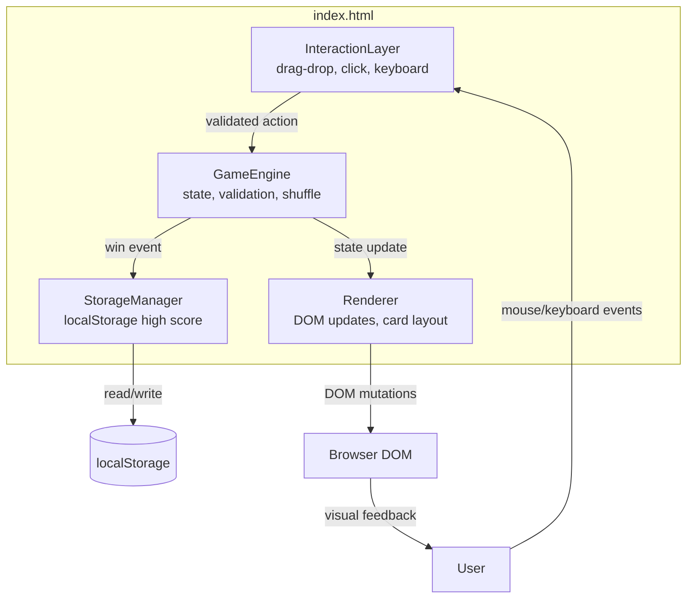

# Architecture

## Overview
Klondike Solitaire is a client-only browser application. All logic runs in the browser — there is no backend, no API server, and no network communication after the initial page load. The entire application is a single `index.html` file served by nginx.

## Component Diagram



## Data Flow

1. **User action** (click, drag, keypress) is captured by the **InteractionLayer**
2. InteractionLayer identifies the action type and target (which card, which pile)
3. **GameEngine** validates the move against Klondike rules
4. If valid: GameEngine updates the **GameState**, pushes to undo stack
5. **Renderer** receives the new state and updates the DOM (moves cards, flips, updates counters)
6. On win: GameEngine notifies **StorageManager** to check/update high score in localStorage
7. If invalid: card snaps back to original position (no state change)

## Component Responsibilities

### GameEngine
- Initializes deck (52 cards) and deals tableau
- Shuffles using Fisher-Yates algorithm
- Validates moves (tableau rules, foundation rules, stock/waste rules)
- Manages game state (card positions, face-up/down, move count)
- Maintains undo stack (full history of moves)
- Detects win condition (all 52 cards in foundations)
- Provides auto-complete detection

### Renderer
- Creates initial DOM structure (piles, card elements)
- Updates card positions and visibility on state change
- Renders card faces (suit symbol, value, color) and backs via CSS
- Manages drag visual (card following cursor)
- Handles win overlay and confetti animation
- Updates header (move counter, high score display)

### InteractionLayer
- Registers event listeners on game container (event delegation)
- Handles mouse events for drag-and-drop
- Handles click events for click-to-move and stock draw
- Handles keyboard events for navigation (Tab, Arrow, Enter, Space)
- Translates raw DOM events into game actions

### StorageManager
- Reads high score from localStorage on init
- Writes high score on win (if new best)
- localStorage key: `klondike-highscore`
- Value schema: `{"bestScore": <number>}`

## Deployment Architecture

```mermaid
graph LR
    B[Browser] -->|HTTP GET /| N[nginx:alpine<br/>port 80]
    N -->|serves| F[/usr/share/nginx/html/<br/>index.html]
```

The Docker container runs nginx:alpine, serving the single `index.html` file. No reverse proxy, no API, no database.

## Constraints
- No external dependencies or CDN links
- No build step — source IS the artifact
- No server-side logic — pure client-side application
- All state in-memory (except high score in localStorage)
- CSS-only rendering — no image assets for cards
