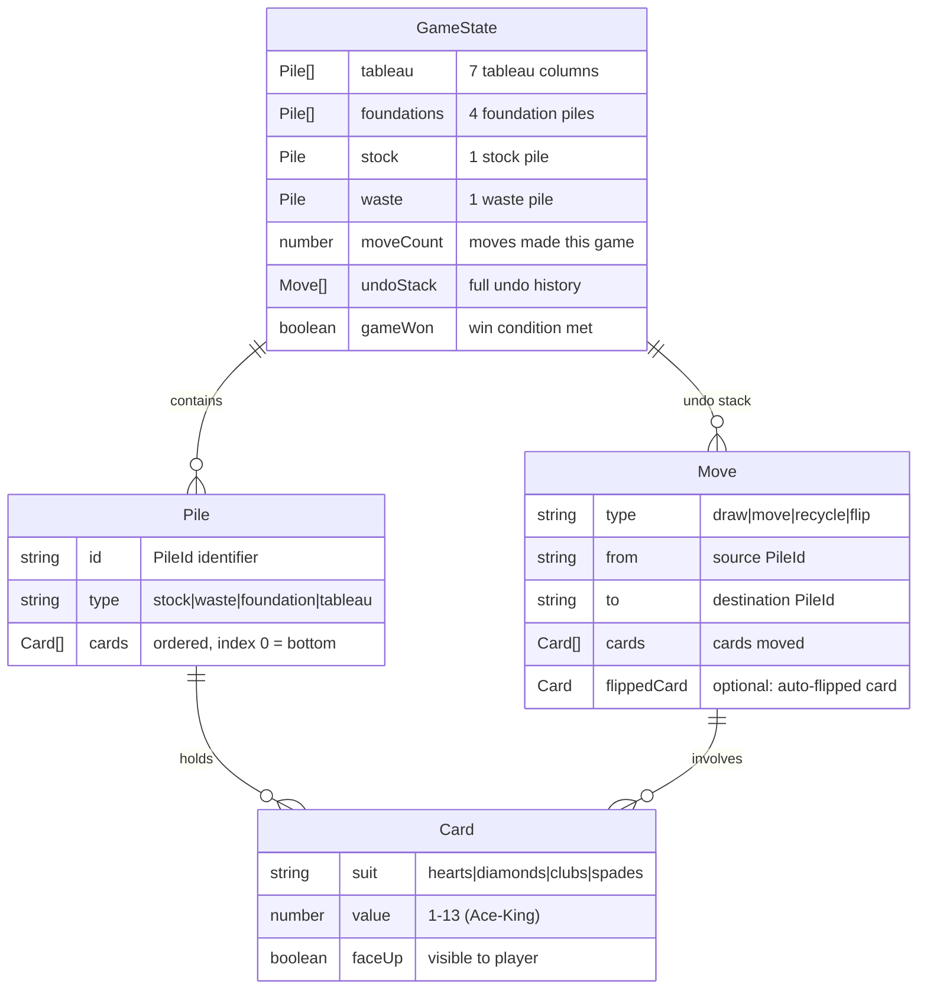

# Data Model

## Entity Relationship Diagram

## Entities

### Card
Represents a single playing card.

| Field | Type | Constraints | Description |
|-------|------|-------------|-------------|
| `suit` | `enum` | `"hearts" \| "diamonds" \| "clubs" \| "spades"` | Card suit |
| `value` | `number` | `1-13` | 1=Ace, 2-10=number, 11=Jack, 12=Queen, 13=King |
| `faceUp` | `boolean` | — | `true` if card face is visible to player |

**Derived properties**:
- **color**: `"red"` if suit is hearts or diamonds, `"black"` if clubs or spades
- **display value**: A, 2-10, J, Q, K
- **suit symbol**: ♥, ♦, ♣, ♠

### Pile
An ordered collection of cards at a specific game location.

| Field | Type | Constraints | Description |
|-------|------|-------------|-------------|
| `id` | `string` | Unique PileId | Identifier (e.g. `"tableau-3"`, `"foundation-0"`) |
| `type` | `enum` | `"stock" \| "waste" \| "foundation" \| "tableau"` | Pile category |
| `cards` | `Card[]` | ordered | Cards in pile, index 0 = bottom of pile |

**Pile counts**:
- Tableau: 7 piles
- Foundation: 4 piles
- Stock: 1 pile
- Waste: 1 pile
- **Total**: 13 piles

### GameState
The complete state of a game in progress.

| Field | Type | Description |
|-------|------|-------------|
| `tableau` | `Pile[7]` | 7 tableau columns |
| `foundations` | `Pile[4]` | 4 foundation piles (one per suit) |
| `stock` | `Pile` | Draw pile |
| `waste` | `Pile` | Flipped cards from stock |
| `moveCount` | `number` | Total valid moves made this game |
| `undoStack` | `Move[]` | Complete move history for undo |
| `gameWon` | `boolean` | `true` when all foundations have 13 cards |

### Move
Represents a single reversible action for the undo stack.

| Field | Type | Description |
|-------|------|-------------|
| `type` | `enum` | `"draw"` (stock→waste), `"move"` (card transfer), `"recycle"` (waste→stock), `"flip"` (auto-flip) |
| `from` | `string` | Source PileId |
| `to` | `string` | Destination PileId |
| `cards` | `Card[]` | Cards that were moved |
| `flippedCard` | `Card?` | Card that was auto-flipped after this move (for undo) |

## Relationships

- **GameState → Pile**: GameState contains exactly 13 piles (7 tableau + 4 foundation + 1 stock + 1 waste)
- **Pile → Card**: Each pile contains 0 or more cards in order (index 0 = bottom)
- **GameState → Move**: Undo stack contains 0 or more moves in chronological order
- **Move → Card**: Each move references the card(s) involved

## Invariants

1. Total cards across all piles is always 52
2. No duplicate cards (each suit+value combination appears exactly once)
3. Foundation piles are always in ascending order (A, 2, 3, ... K) of a single suit
4. Tableau face-up cards are always in descending rank, alternating color
5. Stock cards are always face-down
6. Waste top card is always face-up (if waste is non-empty)

## localStorage Schema

| Key | Value Type | Example |
|-----|-----------|---------|
| `klondike-highscore` | `{"bestScore": number}` | `{"bestScore": 87}` |
